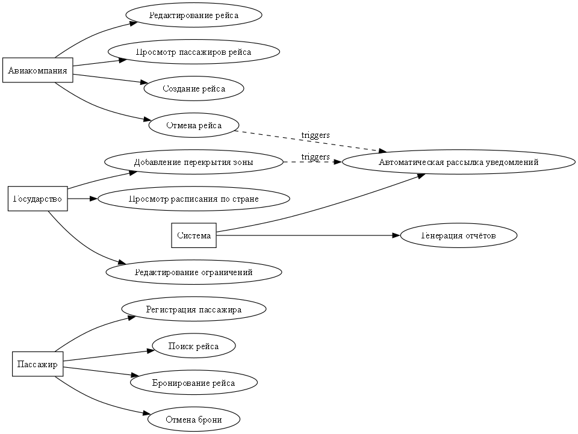

# airflights_schedule_supporter v0.0.1
Support API for country airlines

# Функциональные требования к системе проектирования расписания авиаперелетов

## 1. Общие требования

- Предоставление REST API для взаимодействия с клиентскими приложениями
- Корректные HTTP статусы для всех запросов
- Поддержка пагинации при выдаче списков
- Интерактивная документация API через OpenAPI 3/Swagger
- Хранение данных в реляционной СУБД
- Миграции БД с помощью Liquibase/Flyway
- Логирование всех CRUD-операций
- Поддержка многоаэропортовой модели для работы со всеми аэропортами страны

## 2. Сущности и связи

### Пассажир (Passenger)
- Просмотр расписания рейсов
- Регистрация на рейс (бронь места)
- Отмена брони
- Хранение персональных данных (ФИО, паспорт, контакты)

### Авиакомпания (Airline)
- Создание новых рейсов
- Редактирование рейсов (время, маршрут, самолёт)
- Отмена рейсов
- Просмотр списка пассажиров на рейсе

### Рейс (Flight)
- Связь с авиакомпанией-оператором
- Привязка к аэропортам вылета и прилёта
- Дата/время вылета и прилёта
- Статусы: запланирован, задержан, отменён
- Редактирование расписания с учётом ограничений

### Аэропорт (Airport)
- Данные о местоположении и коде аэропорта
- Список рейсов

### Государственный оператор (Global User / Authority)
- Публикация уведомлений о перекрытии летных зон
- Корректировка расписания рейсов в случае ЧС
- Массовая рассылка уведомлений авиакомпаниям и пассажирам

### Перекрытие летных зон (Flight Restriction)
- Регион и временной интервал
- Автоматическое изменение или отмена затронутых рейсов

### Связи между сущностями
- **Пассажир ↔ Рейс**: Many-to-Many (через таблицу бронирований)
- **Авиакомпания ↔ Рейс**: One-to-Many
- **Аэропорт ↔ Рейс**: One-to-Many (вылет/прилёт)
- **Рейс ↔ Перекрытие летных зон**: Many-to-Many (с полем причины переноса/отмены)

## 3. Функциональные возможности системы

### 3.1. Управление пассажирами
- Регистрация пассажира
- Просмотр списка собственных броней
- Просмотр расписания рейсов
- Отмена бронирования

### 3.2. Управление авиакомпаниями
- Создание, редактирование и удаление рейсов
- Просмотр списка рейсов компании
- Просмотр пассажиров на рейсе
- Уведомление о задержках или изменениях расписания

### 3.3. Управление аэропортами
- Хранение данных об аэропортах
- Список рейсов по каждому аэропорту
- Выгрузка расписания по аэропорту

### 3.4. Управление расписанием рейсов
- Просмотр расписания с пагинацией
- Поиск рейсов по дате, аэропорту, авиакомпании
- Поддержка бесконечной прокрутки расписания
- Пагинация с подсчётом общего количества (в http-заголовке)

### 3.5. Управление летными зонами
- Создание, редактирование и удаление ограничений
- Автоматическая корректировка расписания при наложении ограничений
- Уведомление авиакомпаний и пассажиров о перекрытиях

## 4. Бизнес-логика и транзакции

### Бронирование билета пассажиром
- Транзакция: проверка доступных мест → запись брони → уменьшение количества мест
- **Обоснование**: сохранение консистентности (исключение двойного бронирования одного места)

### Перенос рейсов при введении ограничений
- Транзакция: обновление расписания → уведомление пассажиров → логирование изменений
- **Обоснование**: атомарное выполнение всех шагов для исключения рассинхронизации данных

## 5. Требования к REST API
- CRUD-операции по всем сущностям
- Валидация входных данных на уровне DTO и Entity
- Унифицированный формат ошибок с человеко-читаемым описанием
- Авторизация и аутентификация (JWT)

## 6. Отчётность и уведомления
- Экспорт расписания в JSON/CSV для аэропортов
- Отправка уведомлений об изменениях расписания (email/sms/вебхуки)

## 7. Нефункциональные требования
- Минимальное покрытие тестами (unit + integration) — 70%
- Использование testcontainers для интеграционных тестов с реальной БД
- Использование Docker и Docker Compose для развертывания
- Конфигурация приложения через переменные окружения

# Use Cases системы проектирования расписания авиаперелетов

## Акторы

* **Пассажир** — физическое лицо, использующее систему для поиска и бронирования рейсов.
* **Авиакомпания** — организация, управляющая рейсами и расписанием.
* **Государство (глобальный пользователь)** — орган, регулирующий воздушное пространство и расписание.
* **Система** — программный комплекс, выполняющий бизнес-логику и хранящий данные.

---

## Use Cases для пассажира

### UC-1: Регистрация пассажира

* **Актор:** Пассажир
* **Предусловие:** У пользователя нет учётной записи.
* **Сценарий:**
  1. Пассажир вводит данные (ФИО, паспорт, контакты).
  2. Система валидирует данные.
  3. Система сохраняет запись в БД.
  4. Система возвращает успешный ответ.
* **Альтернативный поток:** Некорректные данные → ошибка 400 с описанием.

### UC-2: Поиск рейса

* **Актор:** Пассажир
* **Сценарий:**
  1. Пассажир выбирает параметры поиска (аэропорт вылета/прилёта, дата, авиакомпания).
  2. Система возвращает список доступных рейсов (пагинация или бесконечная прокрутка).
  3. Пассажир может просмотреть детали рейса.

### UC-3: Бронирование рейса

* **Актор:** Пассажир
* **Предусловие:** Рейс существует, есть свободные места.
* **Сценарий:**
  1. Пассажир выбирает рейс и место.
  2. Система проверяет доступность.
  3. Система создает бронь и уменьшает количество доступных мест (транзакция).
  4. Система возвращает подтверждение.
* **Альтернативный поток:** Нет мест → ошибка 409 (Conflict).

### UC-4: Отмена брони

* **Актор:** Пассажир
* **Сценарий:**
  1. Пассажир выбирает существующую бронь.
  2. Система удаляет бронь и возвращает место в доступные.
  3. Система возвращает успешный ответ.

---

## Use Cases для авиакомпании

### UC-5: Создание рейса

* **Актор:** Авиакомпания
* **Предусловие:** Компания авторизована.
* **Сценарий:**
  1. Авиакомпания вводит данные рейса (аэропорты, самолёт, время, количество мест).
  2. Система валидирует данные.
  3. Система сохраняет рейс.
  4. Возвращается успешный ответ.

### UC-6: Редактирование рейса

* **Актор:** Авиакомпания
* **Сценарий:**
  1. Компания выбирает рейс.
  2. Вносит изменения (например, задержка).
  3. Система обновляет данные.
  4. Пассажиры получают уведомления об изменении.

### UC-7: Отмена рейса

* **Актор:** Авиакомпания
* **Сценарий:**
  1. Компания выбирает рейс.
  2. Система изменяет статус рейса на "отменён".
  3. Все пассажиры получают уведомление об отмене.

### UC-8: Просмотр списка пассажиров рейса

* **Актор:** Авиакомпания
* **Сценарий:**
  1. Компания выбирает рейс.
  2. Система возвращает список пассажиров с бронированиями.

---

## Use Cases для государства

### UC-9: Добавление перекрытия летной зоны

* **Актор:** Государство
* **Сценарий:**
  1. Пользователь вводит регион и время перекрытия.
  2. Система сохраняет ограничение.
  3. Система находит затронутые рейсы.
  4. Система переносит/отменяет рейсы (транзакция).
  5. Авиакомпании и пассажиры получают уведомления.

### UC-10: Редактирование/удаление ограничений

* **Актор:** Государство
* **Сценарий:**
  1. Пользователь выбирает ограничение.
  2. Вносит изменения или удаляет.
  3. Система обновляет расписание рейсов.

### UC-11: Просмотр расписания по стране

* **Актор:** Государство
* **Сценарий:**
  1. Пользователь выбирает временной интервал.
  2. Система возвращает все рейсы по стране с пагинацией.

---

## Use Cases для системы

### UC-12: Автоматическая рассылка уведомлений

* **Актор:** Система
* **Триггер:** Изменение расписания (перенос, отмена, задержка).
* **Сценарий:**
  1. Система определяет затронутых пассажиров и авиакомпании.
  2. Отправляет уведомления через выбранные каналы.

### UC-13: Генерация отчётов

* **Актор:** Система
* **Сценарий:**
  1. Пользователь (авиакомпания/государство) запрашивает отчёт.
  2. Система формирует JSON/CSV-файл.
  3. Файл возвращается пользователю.





## Структура проекта

```
airline-scheduler/
├── build.gradle.kts
├── settings.gradle.kts
├── docker-compose.yml
├── Dockerfile
├── src/
│ ├── main/
│ │ ├── java/com/airflights/
│ │ │ ├── AirlineSchedulerApplication.java
│ │ │ ├── controller/
│ │ │ ├── dto/
│ │ │ ├── entity/
│ │ │ │ ├── Passenger.java
│ │ │ │ ├── Airline.java
│ │ │ │ ├── Airport.java
│ │ │ │ ├── Flight.java
│ │ │ │ ├── RestrictedZone.java
│ │ │ │ └── Booking.java
│ │ │ ├── repository/
│ │ │ ├── service/
│ │ │ └── exception/
│ │ └── resources/
│ │ │ ├── application.yml
│ │ │ ├── db/migration/
│ │ │ └──── 1_init.sql
│ └── test/
│ ├── java/com/example/scheduler/
│ │ ├── integration/
│ │ └── unit/
│ └── resources/
└── README.md
```