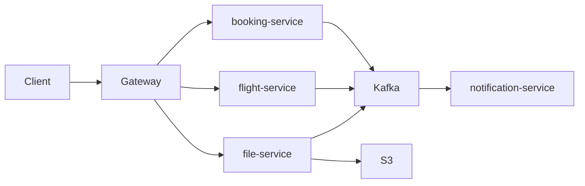
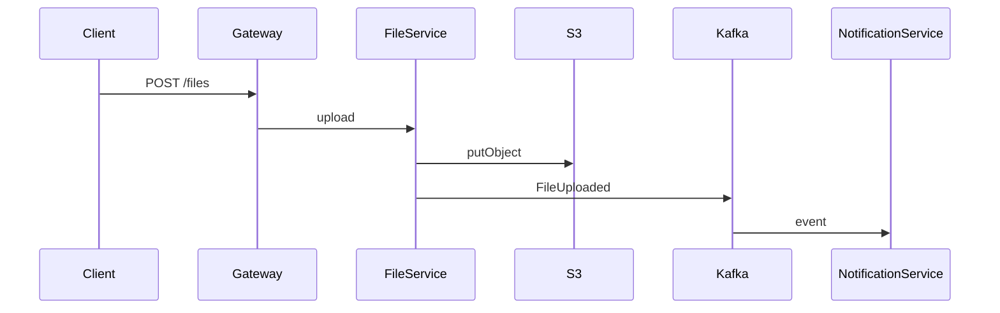

# AirFlights — Бизнес-требования к развитию платформы
**Kafka/RabbitMQ + Уведомления + File Service + S3 + Clean Architecture**

## 0. Назначение документа
Этот документ фиксирует бизнес-требования и критерии приёмки для доработки микросервисной платформы **AirFlights**:
- перевести межсервисное взаимодействие (где это возможно) на **асинхронную событийную модель** через **Kafka или RabbitMQ**;
- добавить **Notification Service** (уведомления) через брокер сообщений;
- добавить **File Service** (загрузка/получение файлов) с использованием **S3-совместимого объектного хранилища**;
- обеспечить соответствие всех микросервисов принципам **Clean Architecture**.

---

## 1. Цели и ожидаемый эффект для бизнеса
### 1.1 Цели
1) Уменьшить связанность микросервисов и снизить риск каскадных отказов за счёт событийной интеграции.
2) Обеспечить централизованную и расширяемую систему уведомлений.
3) Вынести работу с файлами в выделенный микросервис с независимым масштабированием и хранением в S3.
4) Стандартизировать архитектуру микросервисов под Clean Architecture.

### 1.2 Ожидаемый эффект
- Сервисы становятся независимее (меньше синхронных цепочек запросов).
- Ключевые события домена автоматически приводят к нужным последствиям (уведомления, обновления read-model).
- Файлы хранятся централизованно и безопасно, не зависят от дисков контейнеров.

---

## 2. Область работ (Scope)

### 2.1 В Scope
- Развернуть брокер сообщений (**Kafka ИЛИ RabbitMQ**) в dev/stage окружениях:
    - **минимум 3 брокера**
    - **репликация**
    - несколько топиков/очередей
    - DLQ/ошибки/повторы
- Добавить/интегрировать **Notification Service**:
    - подписка на события
    - хранение статуса уведомлений
    - повторы / DLQ
- Добавить/интегрировать **File Service**:
    - upload/download API
    - хранение файла в **S3-compatible storage**
    - публикация событий о файлах
- Привести микросервисы к **Clean Architecture** (минимальные требования ниже).

### 2.2 Вне Scope (если не оговорено отдельно)
- Полная замена всех синхронных HTTP-вызовов (допускается гибрид: sync для query, async для событий).
- UI для уведомлений (если нужно — отдельной задачей).
- Подключение реального email/sms/push провайдера (в MVP допустим in-app + логирование).

---

## 3. Архитектурная концепция

### 3.1 Event-Driven интеграция (основной подход)
- Доменные сервисы публикуют события в брокер.
- Подписчики реагируют асинхронно.
- Для чтения состояния (queries) допускается REST/gRPC через Gateway (или CQRS/read-model).

### 3.2 Транзакционность и устойчивость
- Минимальная гарантия доставки для доменных событий: **at-least-once**.
- Обработчики обязаны быть **идемпотентными**.
- Должны быть реализованы:
    - Retries (ограниченное число)
    - DLQ для “ядовитых” сообщений
    - корреляция запросов (`correlationId/traceId`)

---

## 4. Инфраструктурные требования

### 4.1 Брокер сообщений (Kafka/RabbitMQ)
**Требование:** развернуть **минимум 3 брокера**, включить **репликацию**.

#### Вариант A: Kafka
- Kafka cluster: **3 brokers**
- Репликация:
    - `replication.factor >= 2` (для критичных топиков рекомендуется 3)
- Для Dev/Staging допускается KRaft (без ZooKeeper) или ZooKeeper — на выбор команды.

#### Вариант B: RabbitMQ
- RabbitMQ cluster: **3 nodes**
- Использовать **quorum queues** (рекомендуемо) или mirrored queues (в зависимости от версии).
- Устойчивость очередей и потребителей должна быть подтверждена при выключении 1 узла.

### 4.2 S3 (обязательное требование для File Service)
**Для взаимодействия с файлами обязательно развернуть S3-совместимое объектное хранилище.**
- Dev/Stage: **MinIO** (или эквивалент)
- Prod: любой S3-compatible провайдер (AWS S3, Selectel, Yandex Object Storage и т.д.)

**File Service не должен хранить файлы на локальном диске контейнера.**

---

## 5. Каналы сообщений (топики/очереди) — минимум

> Минимум 3 канала. Рекомендуемый набор:

1) `booking.events` — события бронирований
2) `flight.events` — события рейсов
3) `file.events` — события файлов
4) `notification.commands` — (опционально) команды на отправку уведомлений
5) `*.dlq` — (рекомендуемо) dead-letter канал

### 5.1 Событийные типы (пример)
- Booking:
    - `BookingCreated`
    - `BookingCancelled`
    - `BookingPaid` (если есть)
- Flight:
    - `FlightStatusChanged`
    - `FlightDelayed`
- File:
    - `FileUploaded`
    - `FileDeleted` (опционально)
    - `FileUploadFailed`

---

## 6. Формат событий и контракт

### 6.1 Envelope (обязателен)
Каждое сообщение должно соответствовать единому envelope:

```json
{
  "eventId": "7ed3ad87-1b6f-4aef-9a4d-6d7d1e0c2f1a",
  "eventType": "BookingCreated",
  "eventVersion": 1,
  "occurredAt": "2026-01-14T18:25:43.120Z",
  "producer": "booking-service",
  "correlationId": "c3b1a1b6-2a4f-4f40-82d4-7edc7e9e0c01",
  "traceId": "00-4bf92f3577b34da6a3ce929d0e0e4736-00f067aa0ba902b7-01",
  "payload": {}
}
```

Поле | Описание
---|---
eventId | Уникальный UUID события
eventType | Тип события (BookingCreated, FileUploaded и т.д.)
eventVersion | Версия схемы события
occurredAt | Время генерации события
producer | Имя сервиса-источника
correlationId | Идентификатор бизнес-операции
traceId | Trace ID для distributed tracing
payload | Данные события

### 6.2 Доменные события

BookingCreated
```json
{
  "bookingId": "BKG-102938",
  "userId": "USR-10001",
  "flightId": "FLT-90210",
  "totalPrice": 199.99,
  "currency": "EUR"
}
```

FlightStatusChanged
```json
{
  "flightId": "FLT-90210",
  "oldStatus": "SCHEDULED",
  "newStatus": "DELAYED",
  "reason": "Weather",
  "estimatedDepartureAt": "2026-01-14T20:10:00Z"
}
```

FileUploaded
```json
{
  "fileId": "FIL-abc123",
  "ownerId": "USR-10001",
  "bucket": "airflights-files",
  "objectKey": "user-uploads/USR-10001/FIL-abc123/passport.pdf",
  "contentType": "application/pdf",
  "sizeBytes": 483920
}
```

---

## 7. Notification Service

### 7.1 Назначение
Notification Service подписывается на доменные события и формирует уведомления пользователям и ролям.

### 7.2 Источники событий
Сервис обязан подписываться минимум на:
- `booking.events`
- `flight.events`
- `file.events`

### 7.3 Поддерживаемые уведомления (MVP)
Событие | Получатель | Описание
---|---|---
BookingCreated | Пользователь | Подтверждение бронирования
FlightStatusChanged | Пользователь, авиакомпания | Изменение рейса
FileUploaded | Пользователь | Файл успешно загружен

### 7.4 Хранение
Notification Service хранит уведомления в своей БД:

Notification
- id
- userId
- eventId
- type
- payload
- status (NEW, SENT, FAILED)
- retries
- createdAt

### 7.5 Повторы и DLQ
- Если обработка события не удалась - повторить N раз
- После превышения N - отправить в DLQ
- Дубликаты фильтруются по `eventId`

---

## 8. File Service + S3

### 8.1 Назначение
File Service отвечает за загрузку и получение файлов и использует S3-совместимое объектное хранилище.

### 8.2 API
Метод | Endpoint | Назначение
---|---|---
POST | `/api/files` | Загрузка файла
GET | `/api/files/{id}` | Скачать файл
GET | `/api/files/{id}/meta` | Метаданные
DELETE | `/api/files/{id}` | Удаление (опц.)

### 8.3 Хранение в S3
Bucket: `airflights-files`  
Key: `user-uploads/{userId}/{fileId}/{filename}`

В БД File Service хранит только:

File
- fileId
- ownerId
- bucket
- objectKey
- contentType
- sizeBytes
- createdAt

### 8.4 События
После загрузки файл публикуется:
- FileUploaded
- FileUploadFailed
- FileDeleted

---

## 9. Clean Architecture (обязательна)

Каждый микросервис должен иметь слои:
- interfaces (controllers, consumers)
- application (use cases)
- domain (entities, ports)
- infrastructure (db, kafka, s3, adapters)

Правила:
- domain не зависит от Spring, Kafka, S3, БД
- application зависит только от domain
- infrastructure реализует порты
- controllers и consumers используют application

---

## 10. Архитектурные схемы

### 10.1 Общая схема


### 10.2 File upload flow


---

## 11. Acceptance Criteria

- Kafka/RabbitMQ кластер из 3 брокеров
- Репликация включена
- Минимум 3 топика
- File Service работает через S3
- Notification Service получает события и создает уведомления
- Clean Architecture соблюдена
